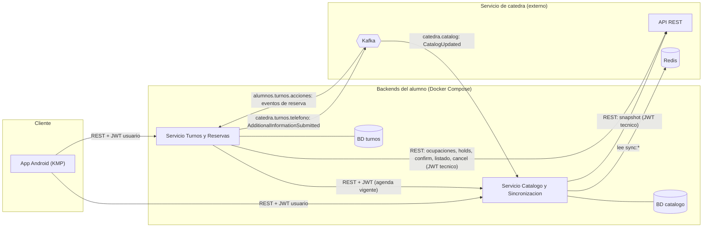
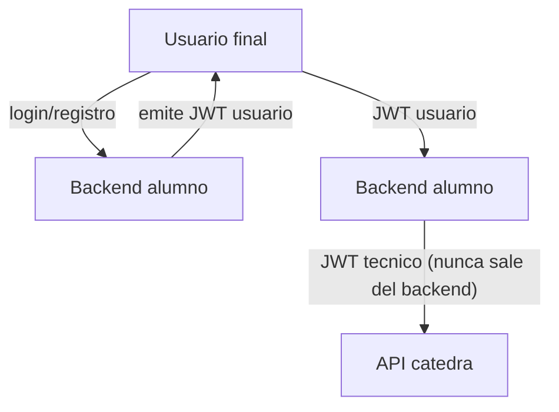

# 01 - Arquitectura general

> Borrador de diseño. Los puntos marcados como **[decidir]** son decisiones abiertas.

## Componentes y comunicaciones

## Reglas que el diagrama debe respetar

- La app KMP **nunca** habla con la catedra ni conoce el JWT tecnico.
- Cada servicio es dueño exclusivo de su BD (esquemas/usuarios separados, migraciones propias).
- Turnos **no** replica el catalogo: le pide la agenda vigente a Catalogo antes de cada operacion nueva.
- Catalogo es el unico que consume `catedra.catalog` y lee Redis `catedra:sync:*`.
- Turnos es el unico que consume `alumnos.turnos.acciones` y produce `catedra.turnos.telefono`.
- Ambos backends comparten la misma cuenta tecnica (mismo JWT de catedra), cargada por variables de entorno.

## Dos identidades, dos JWT

## Decisiones abiertas

- **[decidir]** Quien emite el JWT de usuario (propuesta: Catalogo, estilo JHipster) y como lo valida Turnos (secreto compartido HS256 o clave publica RSA).
- **[decidir]** Comunicacion Turnos -> Catalogo: propagar el JWT del usuario (propuesta, preserva identidad y trazabilidad) o usar un JWT tecnico interno.
- **[decidir]** Motor de BD de cada servicio (ambos en un mismo PostgreSQL con esquemas separados es lo mas simple).
