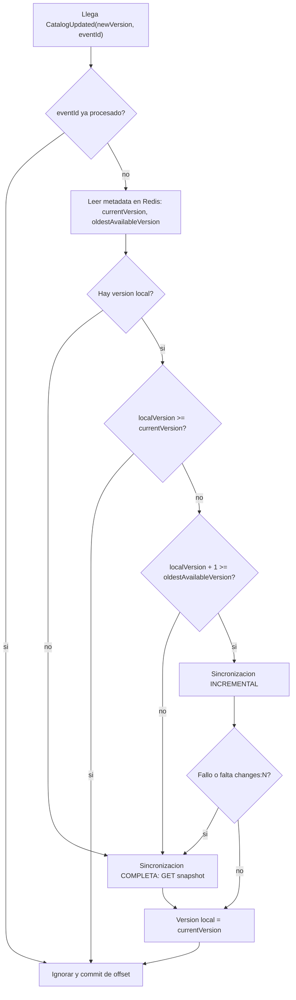
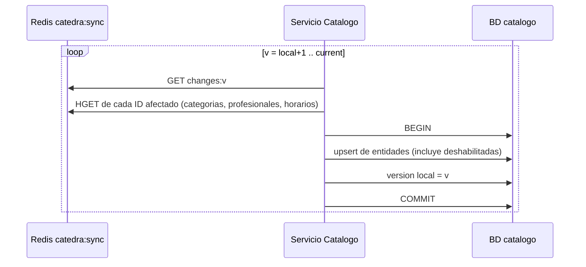
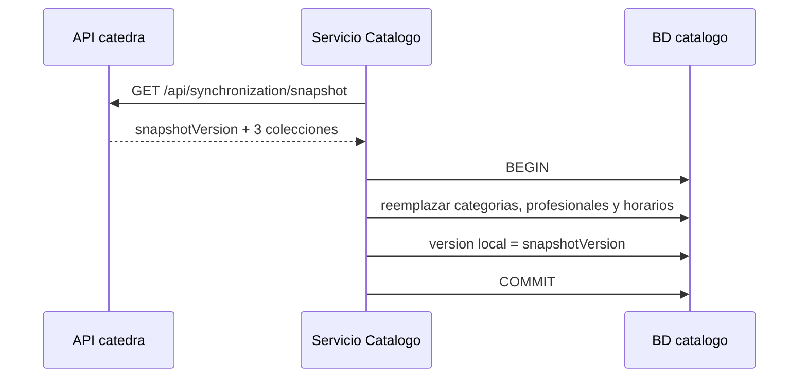

# 02 - Sincronizacion del catalogo

Kafka es solo la **notificacion**; los datos salen de Redis o del snapshot REST.

## Decision: como se procesa una notificacion

## Incremental (version por version, en orden)

La version solo avanza dentro de la misma transaccion que aplica los cambios.

## Completa (snapshot)

Si algo falla antes del COMMIT, no cambia nada: ni datos ni version.

## Cuando se dispara

| Disparador | Accion |
| --- | --- |
| BD vacia al arrancar | Snapshot |
| `CatalogUpdated` | Flujo de decision de arriba |
| Arranque del servicio | Comparar version local con Redis (recupera notificaciones perdidas) |
| Chequeo periodico | Misma comparacion, por si Kafka perdio avisos |
| Estado que no se puede verificar | Snapshot |

## Decisiones abiertas

- **[decidir]** Frecuencia del chequeo periodico por comparacion de versiones.
- **[decidir]** Tabla de eventos procesados (`eventId` unico) y por cuanto tiempo se retiene.
- **[decidir]** Estado y errores de sincronizacion expuestos por REST (requisito 4.1).
