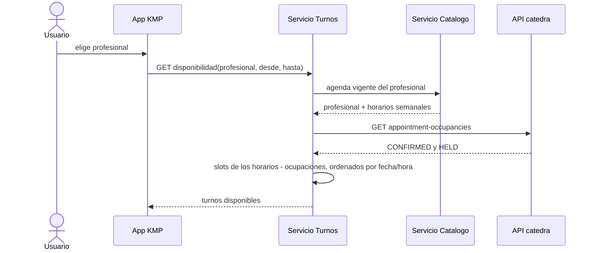
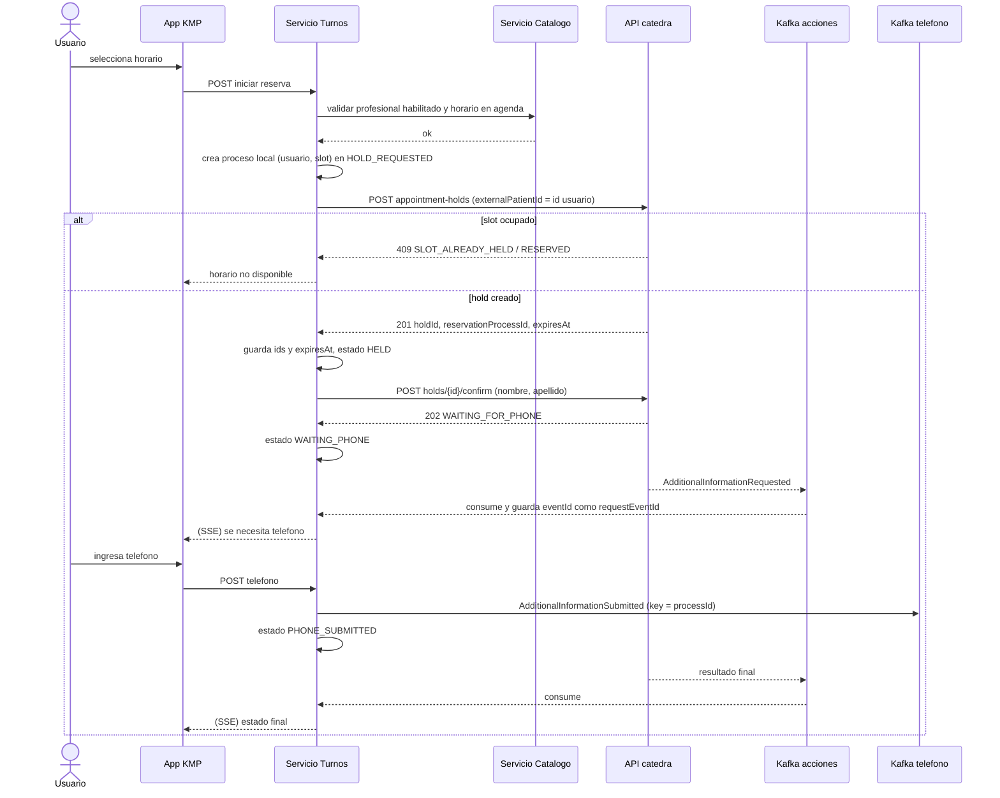
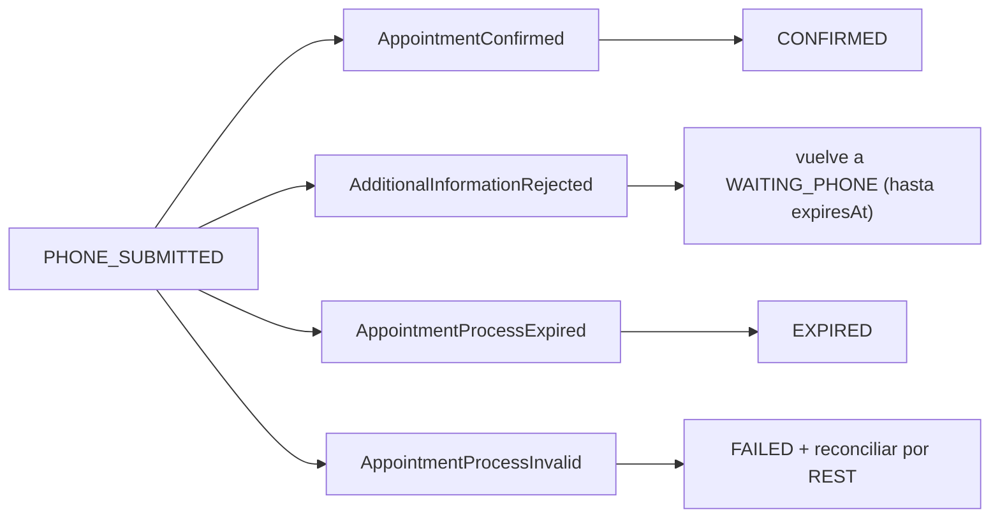
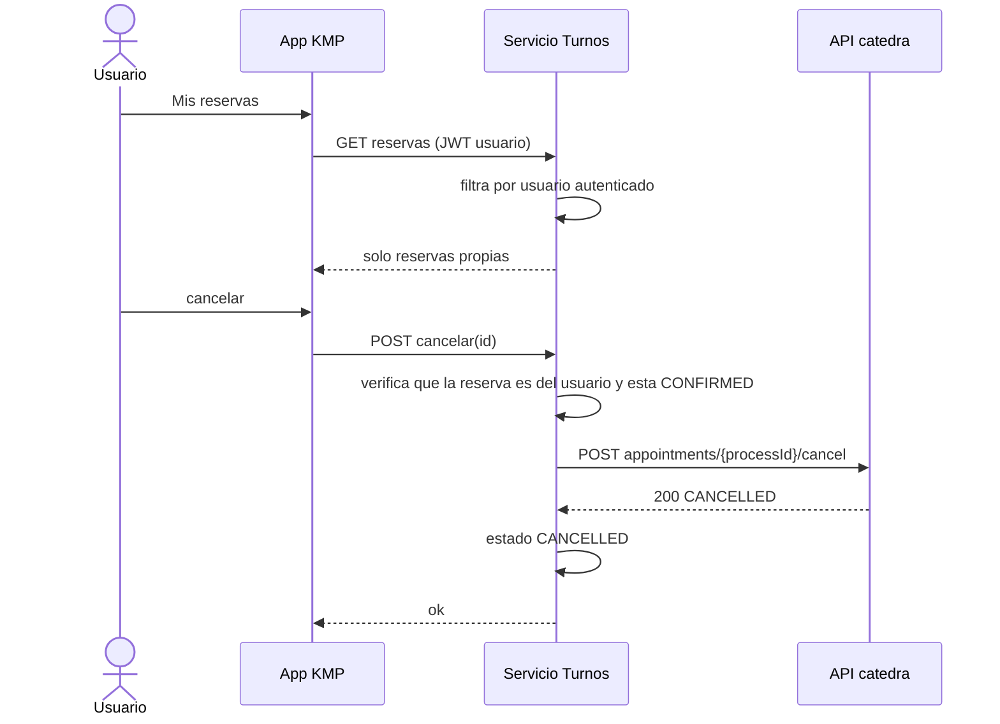

# 03 - Flujo de reserva

## Disponibilidad (solo lectura)

La disponibilidad es una foto: puede quedar vieja. El veredicto real lo da el `POST` del hold.

## Reserva completa

## Resultados finales posibles (Kafka, topic acciones)

## Consulta y cancelacion

## Decisiones abiertas

- **Decidido:** la app se entera por SSE (ver [decisiones.md](../decisiones.md), D5). Al reconectar consulta el estado actual por REST.
- **[decidir]** Que hace el backend si la app nunca envia el telefono (el proceso vence por `expiresAt`).
- **[decidir]** Reintentos y timeouts hacia la API; ante timeout se reconcilia antes de repetir.
