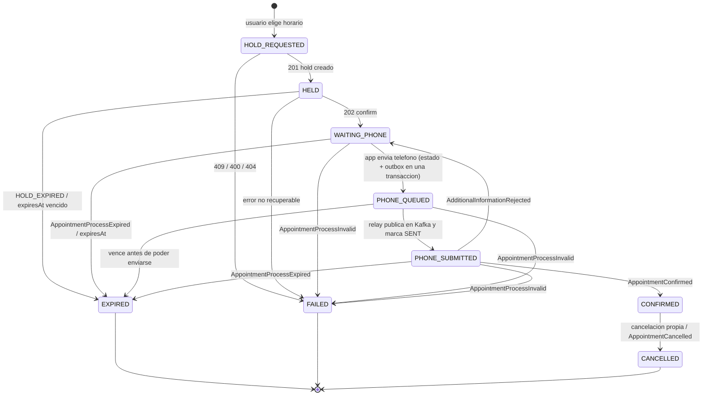
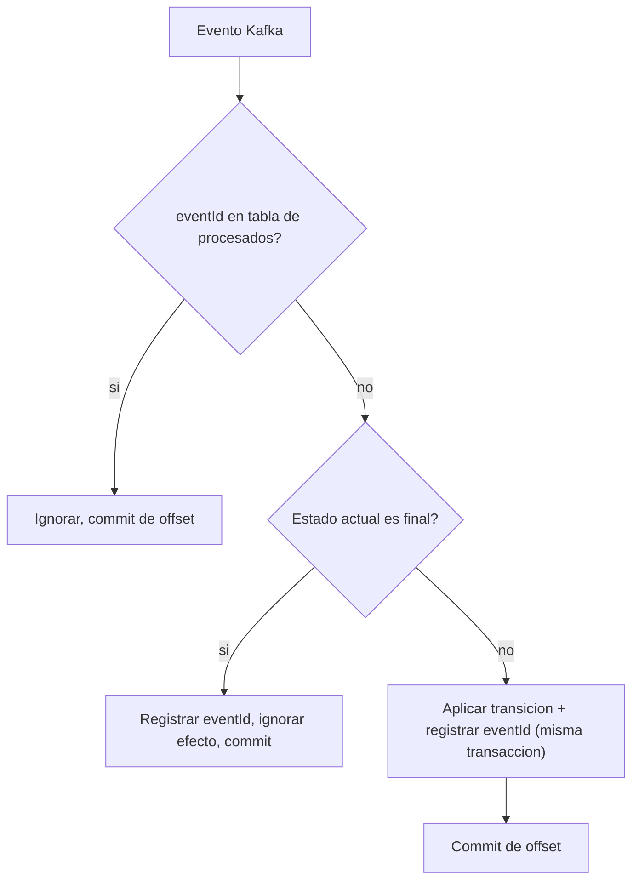

# 04 - Maquina de estados de la reserva (propuesta)

## Reglas

- **Estados finales:** `EXPIRED`, `FAILED`, `CANCELLED`. Un evento tardio o duplicado no los reabre.
- `CONFIRMED` solo puede pasar a `CANCELLED`.
- El relay del outbox al confirmar el ack solo marca la fila como `SENT`; el estado de la reserva pasa a `PHONE_SUBMITTED` unicamente si sigue en `PHONE_QUEUED`. Si `AppointmentConfirmed` llego antes, el estado se mantiene.
- Una transicion invalida para el estado actual se ignora y se registra (no se rompe ni se retrocede).
- REST y Kafka pueden contar la misma cosa en momentos distintos: se avanza solo hacia adelante y gana el estado mas avanzado. `AppointmentConfirmed` puede llegar antes de que REST lo refleje.
- Cada proceso guarda: usuario dueño, `reservationProcessId`, `holdId`, `requestEventId`, `expiresAt`, datos del slot y datos descriptivos historicos del profesional.

## Idempotencia

## Decisiones abiertas

- **[decidir]** Si el mensaje del telefono se publica directo o via tabla outbox (garantiza que no se pierda ante una caida entre guardar estado y publicar).
- **[decidir]** Job de recuperacion al arrancar: procesos no finales con `expiresAt` vencido pasan a `EXPIRED`; los dudosos se reconcilian con `GET /api/appointments`.
