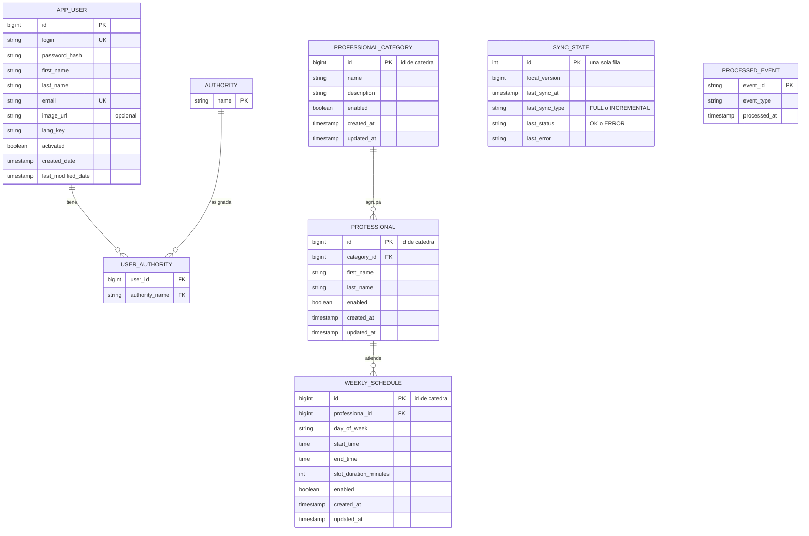
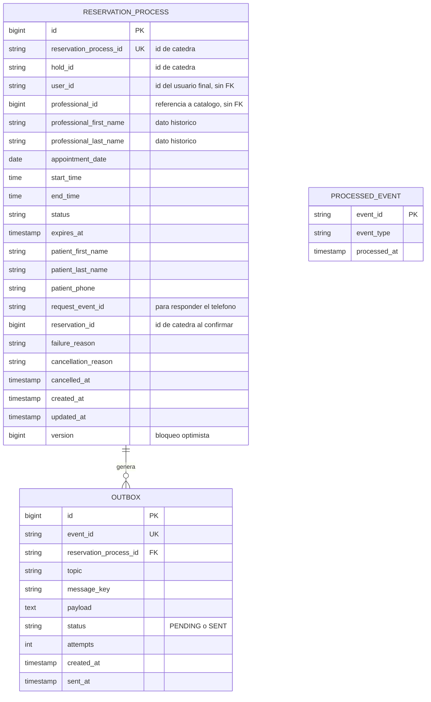
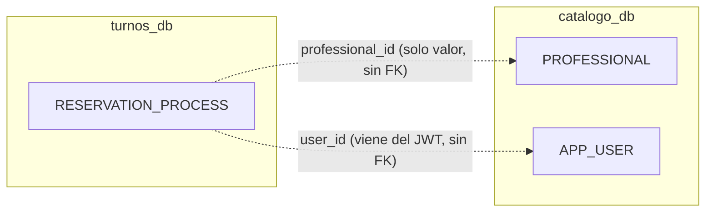

# 05 - Modelo de datos (propuesta)

Cada servicio tiene su **propia base logica** en PostgreSQL, con usuario propio y migraciones independientes. No hay claves foraneas entre ambas bases.

## Servicio Catalogo (`catalogo_db`)

Notas:

- Las entidades del catalogo conservan el **ID de la catedra** como clave primaria (no se generan IDs propios), para poder aplicar cambios por ID.
- Las bajas de la catedra son logicas (`enabled = false`): se guardan, no se borran.
- `SYNC_STATE.local_version` solo se actualiza en la misma transaccion que aplica los datos.
- `APP_USER` y `AUTHORITY` replican el modelo de usuario de JHipster (requisito de compatibilidad del enunciado).
- `SYNC_STATE` cubre "informar estado y errores de sincronizacion" (4.1).

## Servicio Turnos (`turnos_db`)

Notas:

- `user_id` identifica al dueño de la reserva. Viene del JWT (no del cliente) y se envia a la catedra como `externalPatientId`. Toda consulta y cancelacion filtra por este campo.
- `professional_id` y los nombres son **datos descriptivos historicos**: sirven para mostrar la reserva, no como catalogo vigente (el enunciado lo permite y lo restringe).
- `status`: `HOLD_REQUESTED`, `HELD`, `WAITING_PHONE`, `PHONE_QUEUED`, `PHONE_SUBMITTED`, `CONFIRMED`, `EXPIRED`, `FAILED`, `CANCELLED` (ver [04](04-maquina-estados-reserva.md)).
- `version` evita que dos eventos concurrentes (REST y Kafka) pisen el mismo proceso.
- `reservation_process_id` es unico: garantiza que no haya reservas duplicadas para el mismo proceso.
- `OUTBOX` y `PROCESSED_EVENT` son tecnicas, no del dominio.

## Fronteras de propiedad

Las lineas punteadas son referencias **por valor**. El servicio de turnos nunca consulta la base de catalogo: pide la agenda por REST. Esto respeta la regla de "no acceder a tablas del otro servicio".

## Decisiones

- **Identificador del usuario:** el `id` numerico de `APP_USER`, incluido como claim en el JWT y enviado como texto en `externalPatientId`. Es inmutable, a diferencia de cualquier dato editable, y la catedra asocia las reservas a ese valor.
- **Telefono:** se conserva en `RESERVATION_PROCESS.patient_phone` (la catedra tambien lo devuelve en el listado).
- **Indices:** por `user_id`, por `status` + `expires_at` (job de recuperacion) y por `status` en `OUTBOX`.
