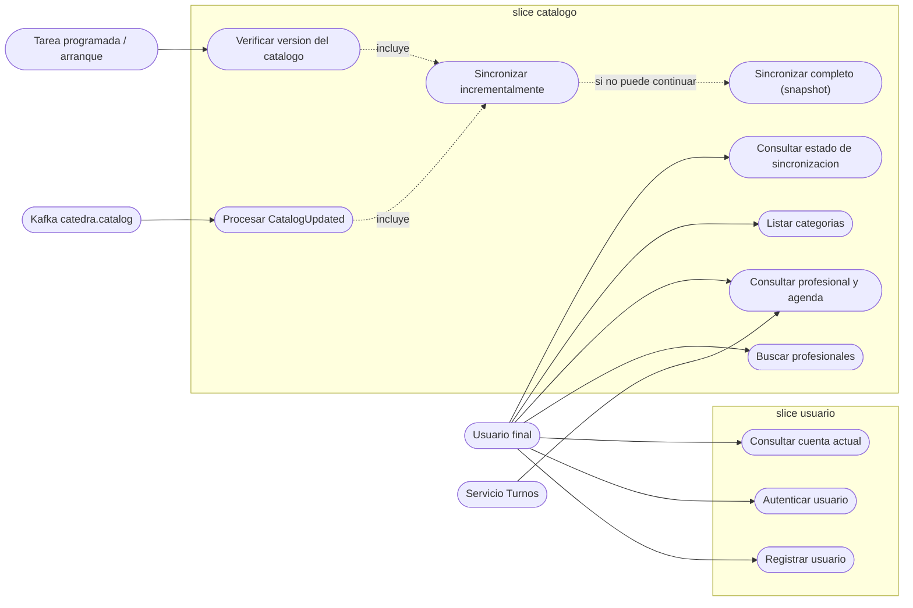
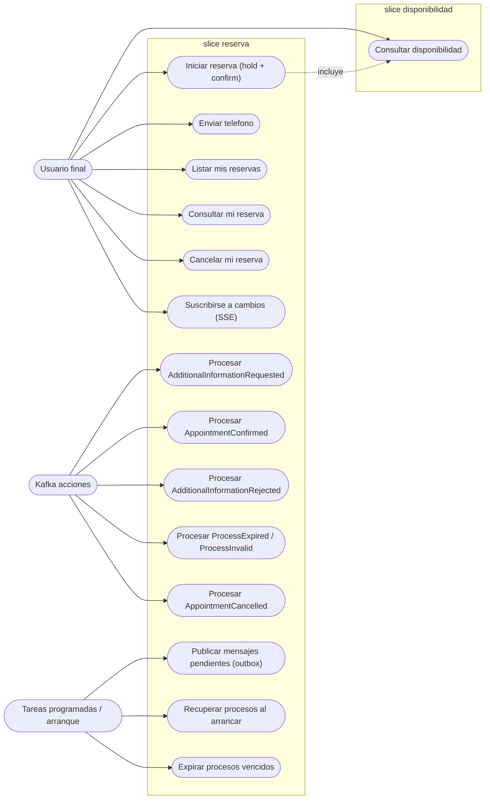

# 06 - Casos de uso

En arquitectura hexagonal cada caso de uso es una interfaz en `domain/ports/in` (una por caso). Este documento es el **catalogo de esos puertos de entrada** y de quien los invoca (adaptador de entrada: controller, listener Kafka o tarea programada).

Slices propuestos: `usuario` y `catalogo` en el servicio de catalogo; `disponibilidad` y `reserva` en el servicio de turnos.

## Servicio Catalogo

## Servicio Turnos

`R1` incluye una validacion contra el servicio de catalogo (agenda vigente) antes de pedir el hold; `A1` tambien la usa.

## Catalogo de puertos de entrada (nombres propuestos)

### usuario

| Caso de uso | Puerto `in` | Adaptador de entrada |
| --- | --- | --- |
| Registrar usuario | `RegisterUserUseCase` | `POST /api/register` |
| Autenticar usuario | `AuthenticateUserUseCase` | `POST /api/authenticate` |
| Consultar cuenta actual | `GetCurrentUserUseCase` | `GET /api/account` |

### catalogo

| Caso de uso | Puerto `in` | Adaptador de entrada |
| --- | --- | --- |
| Buscar profesionales | `SearchProfessionalsUseCase` | `GET /api/professionals` |
| Consultar profesional y agenda | `GetProfessionalByIdUseCase` | `GET /api/professionals/{id}` |
| Listar categorias | `GetAllCategoriesUseCase` | `GET /api/professional-categories` |
| Consultar estado de sincronizacion | `GetSyncStatusUseCase` | `GET /api/sync/status` |
| Procesar CatalogUpdated | `HandleCatalogUpdatedUseCase` | `@KafkaListener` |
| Sincronizar incrementalmente | `IncrementalSyncUseCase` | invocado por los dos anteriores |
| Sincronizar completo | `FullSyncUseCase` | invocado por los anteriores |
| Verificar version del catalogo | `CheckCatalogVersionUseCase` | `@Scheduled` y arranque |

### disponibilidad

| Caso de uso | Puerto `in` | Adaptador de entrada |
| --- | --- | --- |
| Consultar disponibilidad | `GetAvailabilityUseCase` | `GET /api/availability` |

### reserva

| Caso de uso | Puerto `in` | Adaptador de entrada |
| --- | --- | --- |
| Iniciar reserva | `StartReservationUseCase` | `POST /api/reservations` |
| Enviar telefono | `SubmitPhoneUseCase` | `POST /api/reservations/{id}/phone` |
| Listar mis reservas | `GetAllReservationsUseCase` | `GET /api/reservations` |
| Consultar mi reserva | `GetReservationByIdUseCase` | `GET /api/reservations/{id}` |
| Cancelar mi reserva | `CancelReservationUseCase` | `POST /api/reservations/{id}/cancel` |
| Suscribirse a cambios | `SubscribeReservationEventsUseCase` | `GET /api/reservations/stream` (SSE) |
| Procesar eventos de la catedra | `HandleAdditionalInformationRequestedUseCase`, `HandleAppointmentConfirmedUseCase`, `HandleAdditionalInformationRejectedUseCase`, `HandleProcessClosedUseCase`, `HandleAppointmentCancelledUseCase` | `@KafkaListener` |
| Publicar mensajes pendientes | `PublishPendingMessagesUseCase` | `@Scheduled` |
| Recuperar procesos al arrancar | `RecoverReservationsUseCase` | `ApplicationReadyEvent` |
| Expirar procesos vencidos | `ExpireOverdueReservationsUseCase` | `@Scheduled` |

## Notas de diseño

- Los eventos de la catedra que llegan por Kafka son **casos de uso como cualquier otro**; el listener solo los traduce a un objeto de dominio y llama al puerto. Asi se pueden probar sin Kafka.
- Los casos de uso de eventos aplican idempotencia (`processed_event`) y las transiciones de la maquina de estados ([04](04-maquina-estados-reserva.md)).
- `HandleProcessClosedUseCase` agrupa `AppointmentProcessExpired` y `AppointmentProcessInvalid`: ambos cierran el proceso con distinto estado final.
- Los puertos `out` (repositorios, cliente de la catedra, Redis, publisher Kafka, cliente de catalogo) se definen al implementar cada slice.
